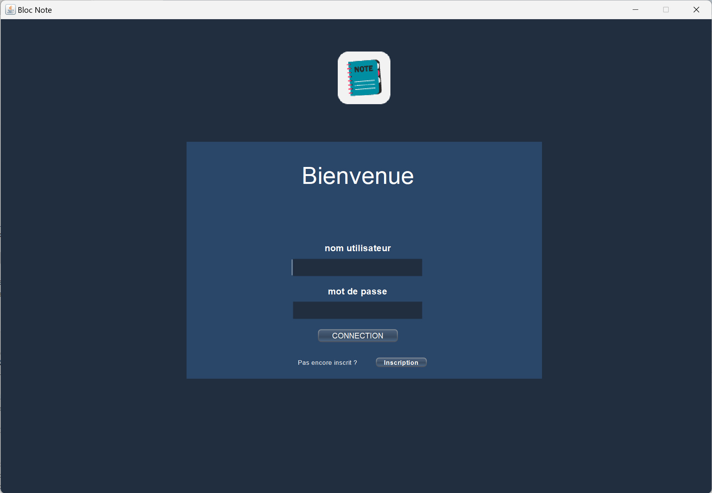
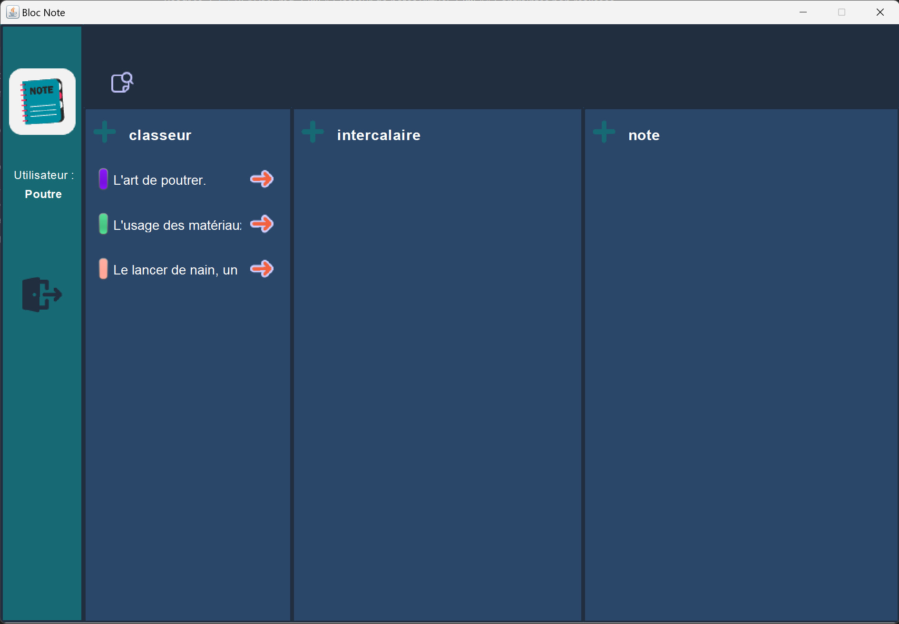
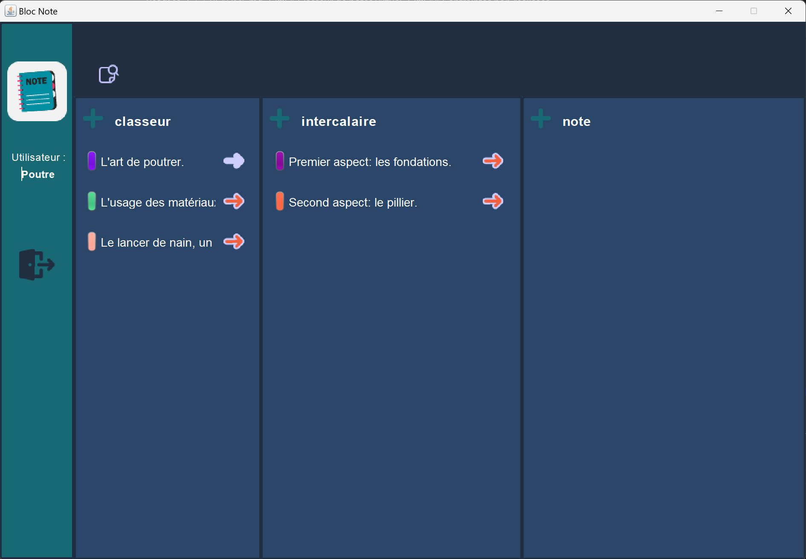
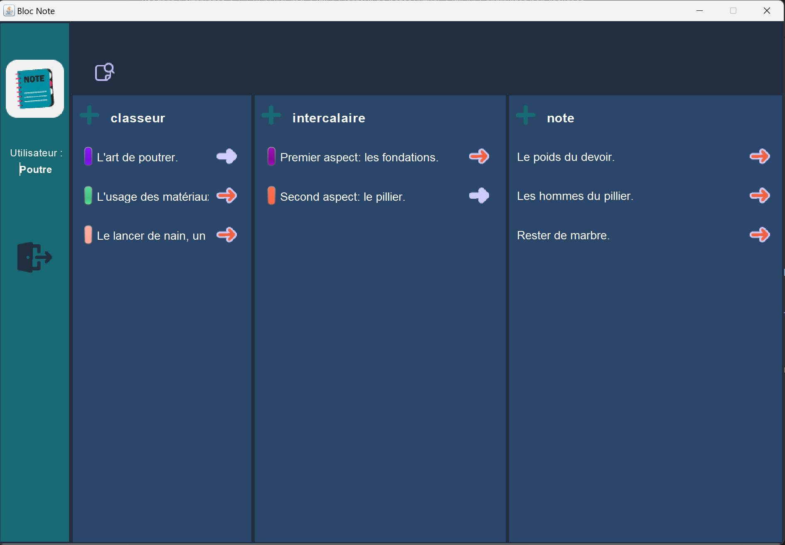
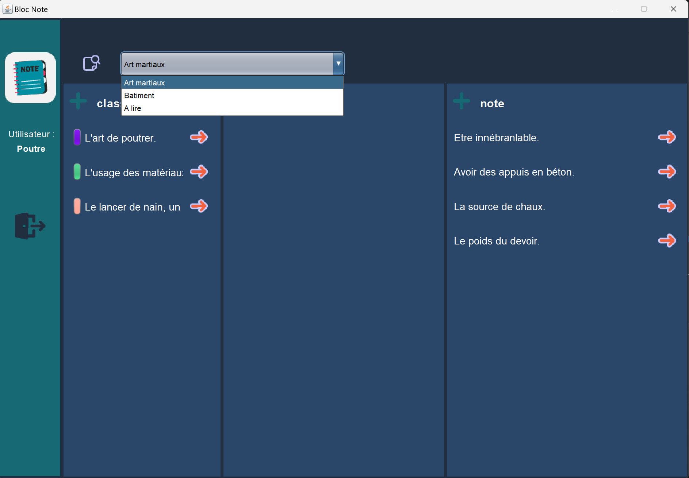
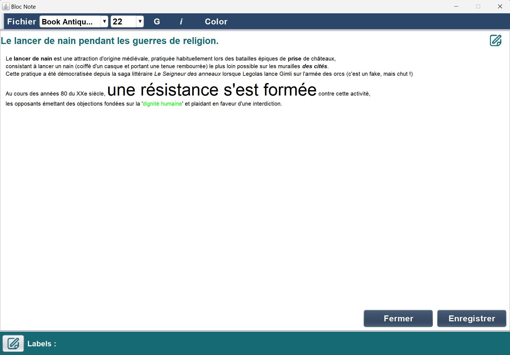
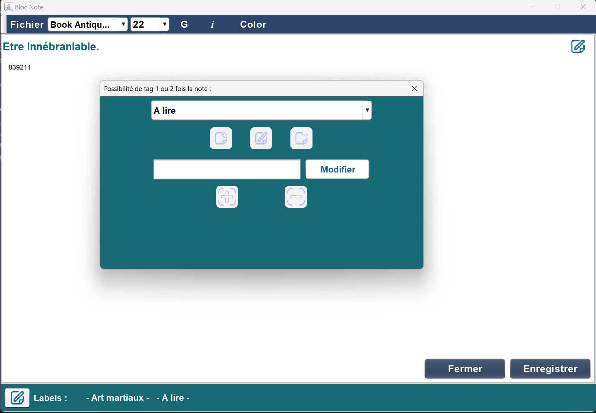

# Classeur virtuel de notes 

Un projet réalisé pour le cours de Java.
<strong>Délais :</strong> environ 12 jours.

## Participants et tâches accomplies
Nous avons réalisé ce projet à trois : deux développeurs full stack, un dévelopeur front-end

<u>ROBIN</u> : développeur full-stack
- création et gestion de la base de données en modèle relationnel
- intégration du driver de MariaDB
- définition des requêtes SQL
- injection des données en front
- gestion des bugs

<u>SYLVAIN</u> : développeur front-end/design
- maquettage interface/application,
- organigramme de l’application (pages d’inscription, login, page principale comprenant
menu, classeurs, intercalaires et notes),
- implémentation du graphisme en code,
- personnalisation du nuancier.

<u>SANDRINE</u> : développeuse full-stack
- développement de l’éditeur de texte enrichi (ToolBar flottante, gestion de l’enrichissement
du texte),
- gestion des labels,
- système d’enregistrement de fichiers utilisé en développement mais pas implémenté,
- gestion des bugs.

## Langages utilisés
- Java EE

## Environnement de travail
- Java Swing
- Apache Netbeans
- Apache Maven
- GIT
- Plugin Assembly de Mave
- Driver JDBC (Java DataBaseConnector)
- MariaBD

## Réalisations demandées
- créer une application
- le but est de ranger des notes et des données 
- une organisation basée sur des classeurs et des intercalaires
- multi-utilisateurs 
- chacun a son système de classification et de stockage personnel
- créer différents classeurs qui intègrent leur propre intercalaire et leur propre note 
- les classeurs et les intercalaires peuvent être personnalisés par un choix colorimétrique 
- les notes peuvent être étiquetées
- données stockées sur un serveur local ou distant

## Réalisations supplémentaires
- lire et enregistrer les notes dans un fichier local (code en commentaire dans l'éditeur)

## Contraintes non réalisées
Aucune

<h2 style="text-align: center;">Images de l'application de note</h2>

<h4 style="text-align: center;">Accueil de l'application (Connexion/inscription) :</h4>

 

<h4 style="text-align: center;">Affichage des classeurs du compte Poutre :</h4>

 

<h4 style="text-align: center;">Affichage des intercalaires du classeur "L'art de poutrer" :</h4>

 

<h4 style="text-align: center;">Affichage des notes de l'intercalaire "Second aspect : le pillier" :</h4>

 

<h4 style="text-align: center;">Filtrage des étiquettes :</h4>

 

<h4 style="text-align: center;">Editeur de texte :</h4>

 

<h4 style="text-align: center;">Etiquettes (ajout nouveau, modification, suppression, ajout à la note, suppression de la note) :</h4>

 

<h3 style="text-align:center;font-weight:bold; font-size:50">FIN</h3>
